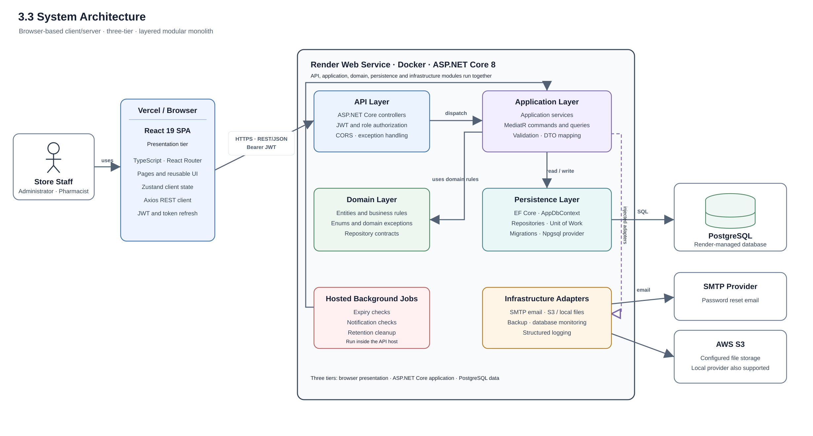

# 3.3 System Architecture

The Milki Drug Store Management System uses a **browser-based client–server, three-tier architecture**. Its backend is organized as a **layered modular monolith**: the API, application, domain, persistence, infrastructure, and hosted background services are separate modules, but they run together in one ASP.NET Core API service. The system is not implemented as a set of microservices.

## Architecture layers

1. **Presentation tier:** Administrators and pharmacists use a React 19 single-page application written in TypeScript. React Router handles page navigation, Zustand stores client-side state, and Axios sends REST requests to the backend. The deployment configuration targets Vercel for the frontend.
2. **API and application tier:** The ASP.NET Core 8 Web API exposes REST endpoints through controllers. JWT bearer authentication and role-based authorization protect requests. Application services and selected MediatR command and query handlers coordinate use cases, with DTO mapping and service-level checks. FluentValidation classes exist, but no automatic validator registration or validation pipeline was found. The domain module contains business entities, rules, enums, exceptions, and repository contracts.
3. **Data tier:** The persistence module uses Entity Framework Core, `AppDbContext`, repositories, a unit of work, and migrations. The configured provider is PostgreSQL through Npgsql. The deployment configuration targets a Render-managed PostgreSQL database.

Infrastructure adapters provide email through SMTP, file storage through S3 or a local provider, database backup, monitoring, and logging. Expiry checking, notification checking, and data-retention cleanup run as hosted background services inside the API host.

## Request and data flow

An administrator or pharmacist uses the browser application, which sends an HTTPS REST/JSON request with a JWT bearer token to the API. A controller authenticates and authorizes the request, then passes it to an application service or command/query handler. The application workflow applies domain rules and uses persistence components to read or update PostgreSQL. The API returns the result to the frontend for display.

The repository configuration describes a Vercel frontend, Dockerized ASP.NET Core API on Render, and PostgreSQL on Render; it also selects an S3 file storage provider and configures SMTP options. This is the intended topology, not proof of current operation: on 10 October 2026 the frontend URL returned HTTP 200 while the configured Render API health URL returned HTTP 404 with x-render-routing: no-server.

**Figure 3.3. System Architecture**

The diagram shows the configured target topology, not a verified live service state. The diagram is available as a [PNG image](system-architecture.png), [scalable SVG](system-architecture.svg), and [editable PlantUML source](system-architecture.puml).
