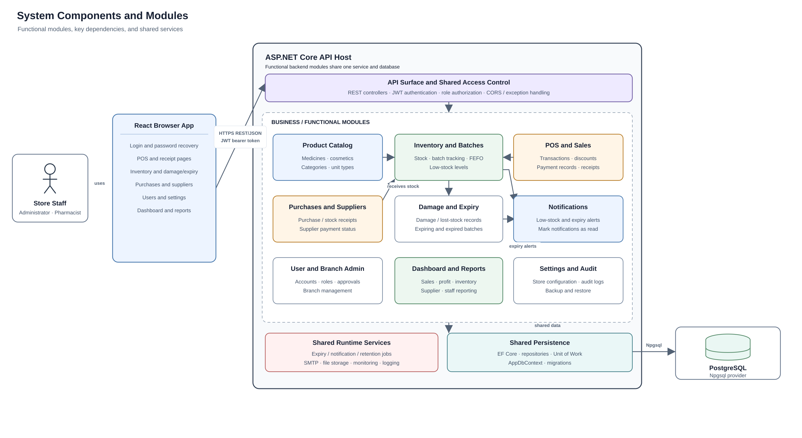

# 3.4 System Components/Modules

The system is organized into functional modules behind the ASP.NET Core API. The React application presents these functions to administrators and pharmacists. The API applies authentication and role checks, routes requests to application services and handlers, and the modules share the same persistence layer and PostgreSQL database.

## Major modules

1. **Authentication and authorization:** Handles sign-in, token refresh, password recovery, JWT validation, and Admin/Pharmacist role checks. Authorization is applied across the API.
2. **User and branch management:** Allows administrators to manage user accounts, roles, approval status, and store branches.
3. **Product catalog:** Maintains medicine and cosmetic products, categories, and unit types.
4. **Inventory and batches:** Tracks stock by branch and batch, including quantities, prices, low-stock levels, and expiry dates. Sales and purchases update stock.
5. **Point of sale and sales:** Supports product lookup, cart and discount handling, recording payment methods, saving sales, and generating receipts.
6. **Purchases and suppliers:** Records stock purchases and supplier information, including purchase payment status.
7. **Damage and expiry:** Records damaged or lost stock and identifies expiring and expired batches.
8. **Notifications:** Presents low-stock and expiry alerts and lets staff mark notifications as read. Hosted jobs check for expiry and notification updates.
9. **Dashboard and reporting:** Summarizes business activity and produces sales, profit, inventory, supplier, and staff reports.
10. **Settings and audit:** Manages store configuration, records audit activity, and provides database backup and restore functions.

The modules are parts of one backend service, not separately deployed services. They share EF Core persistence and PostgreSQL. Payment handling records methods and statuses within sales and purchases; the current system does not connect to an external payment gateway.

**Figure 3.4. System Components and Module Dependencies**

The diagram is available as a [PNG image](system-components.png), [scalable SVG](system-components.svg), and [editable PlantUML source](system-components.puml).
