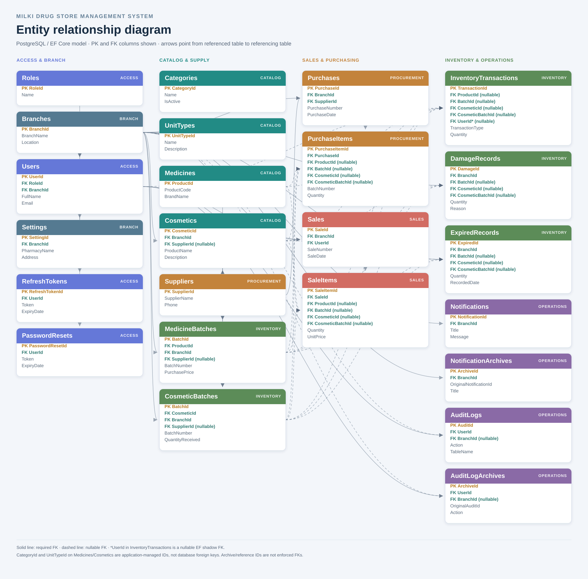
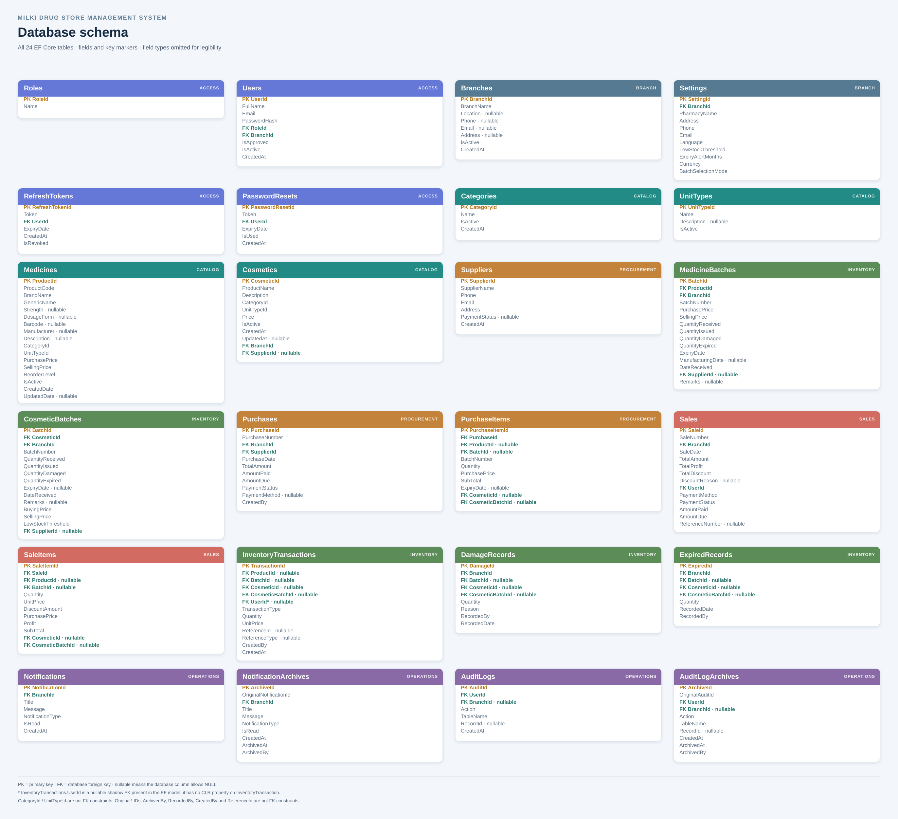

# 3.5 Entity Relationship Diagram and Database Schema

The Milki Drug Store Management System uses a PostgreSQL relational database through Entity Framework Core. Its current model contains 24 tables covering users and branches, the product catalog, stock batches, purchases, sales, inventory records, notifications, audit history, and application settings.

## Entity relationships

The diagram marks primary keys and database foreign keys. Solid connectors indicate required foreign keys; dashed connectors indicate nullable foreign keys. The arrow points from the referenced table to the table containing the foreign key.

Each branch has one settings row; `Settings.BranchId` is a unique foreign key.

## Database schema

The schema image lists the modeled fields and marks primary keys, foreign keys, and nullable fields. It follows the current EF Core model snapshot. `CategoryId` and `UnitTypeId` on medicines and cosmetics are not configured as database foreign keys. `InventoryTransactions.UserId` is a nullable shadow foreign key generated by EF Core and is not a CLR property on the entity. Archive source IDs and audit/reference IDs are stored values without enforced relationships.

The diagrams are also available as [ER diagram SVG](er-diagram.svg), [database schema SVG](database-schema.svg), and [editable PlantUML source](er-diagram.puml).
