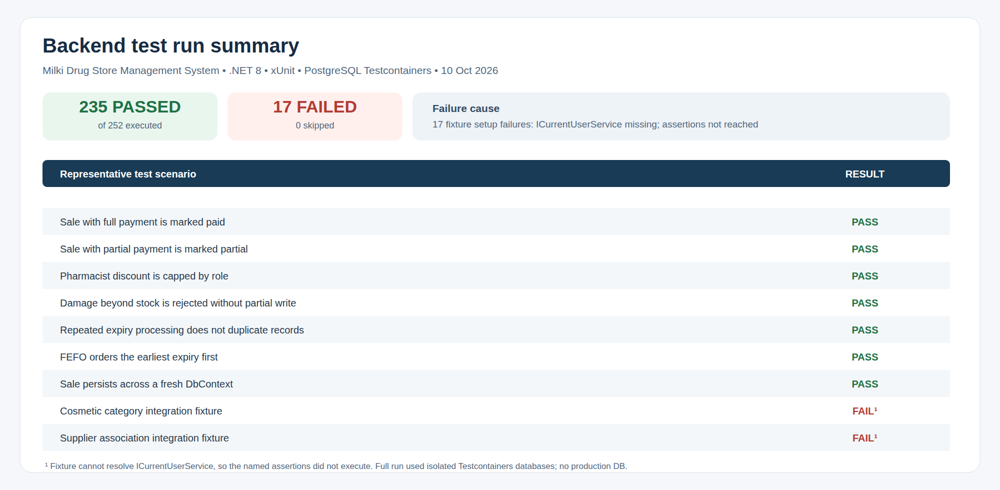

# 3.6 Testing

## Testing approach and tools

The backend test project targets .NET 8 and references xUnit, Moq, FluentAssertions, EF Core InMemory, ASP.NET Core WebApplicationFactory, and Testcontainers for PostgreSQL. The suite contains unit, API integration, and PostgreSQL integration tests. The frontend has no test script or frontend test files in this checkout.

## Latest executed result (10 October 2026)

The full solution was run with PostgreSQL Testcontainers and isolated ephemeral databases:

~~~bash
dotnet test backend/MilkiDrugStore.sln --configuration Release --no-restore \
  --logger 'trx;LogFileName=project-defense.trx' \
  --results-directory /tmp/mdsms-project-defense-testresults
~~~

**Result: 252 total, 235 passed, 17 failed, 0 skipped.** The command exited with code 1. Docker was available; this run used isolated test containers and did not target production data.

All 17 failures are in `CosmeticCategoryIntegrationTests` (9 cases) and `InventorySupplierTests` (8 cases). Their test fixture dependency injection cannot construct MedicineService/CosmeticService because `ICurrentUserService` is not registered. The failures occur before those tests reach their assertions. Fixing those fixture registrations and rerunning is necessary before drawing conclusions about those specific assertions.

The raw TRX file is at `/tmp/mdsms-project-defense-testresults/project-defense.trx`; it is outside the repository. Older local run artifacts also contain failures. The former statement “171 passed, 0 failed” is stale and must not be presented as current evidence.

## Representative cases from the latest run

| Test case | Observed outcome | Meaning |
|---|---|---|
| Sale with full payment | PASS | Covered sale is marked paid |
| Sale with partial payment | PASS | Covered sale is marked partial |
| Pharmacist discount cap | PASS | Covered discount is capped by role |
| Reject damage beyond available stock | PASS | Covered over-stock damage is rejected without partial write |
| Rerun expiry processing | PASS | Covered expiry sweep does not duplicate records |
| FEFO earliest-expiry ordering | PASS | Covered batch ordering prioritizes earlier expiry |
| Sale survives context recycle | PASS | Isolated persistence test reads data after context recreation |
| Built-in cosmetic category integration case | FAIL | Test fixture missing ICurrentUserService; assertion not reached |
| Supplier association integration case | FAIL | Test fixture missing ICurrentUserService; assertion not reached |

Editable vector: [test-case-table.svg](test-case-table.svg). This is a representative result summary, not a coverage metric.

## Build verification

`npm run build` in `frontend/` succeeded on 10 October 2026. Vite warned that `settingsApi.ts` is both dynamically and statically imported and that the main minified chunk exceeds 500 kB. The backend build completed as part of `dotnet test`; analyzer/compiler warnings included interpolated raw SQL in two PostgreSQL sequence-lock queries, an async method without await, nullable warnings in tests, and xUnit analyzer warnings.

## Follow-up

Register a deterministic `ICurrentUserService` mock/current-user instance in the two affected test fixture setups, run those tests and the full suite again, and preserve the fresh TRX. Add frontend automated tests and concurrency/expiry/payment-boundary cases. No application code was changed during this documentation task.
