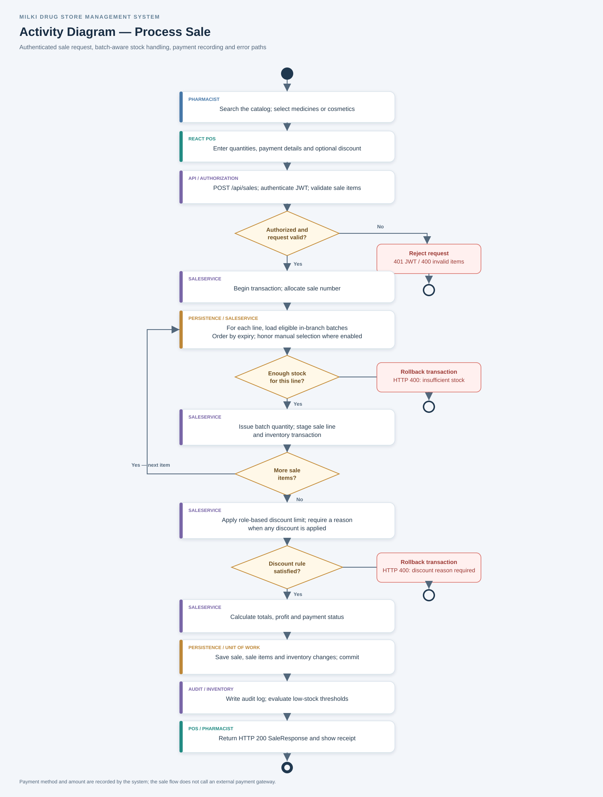
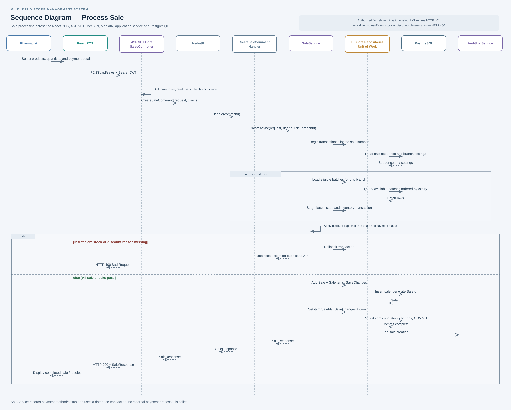

# 3.7 Activity and Sequence Diagrams

These diagrams describe the implemented sale workflow. A pharmacist selects products in the React POS and submits a sale to the ASP.NET Core API. The API authenticates the request, sends a `CreateSaleCommand` through MediatR, and delegates processing to `SaleService`. The service checks branch inventory, applies discount rules, records the sale and stock movements, and commits them through EF Core. Payment details and status are stored in the sale; no external payment gateway is called.

## Activity diagram: Process sale

The flow includes authorization, batch stock checks, discount reason handling, transaction rollback on errors, persistence, and the sale response.

## Sequence diagram: Process sale

The sequence shows communication between the pharmacist, React POS, API controller, MediatR command handler, sale service, EF Core repositories/unit of work, PostgreSQL, and audit logging.

The diagrams are available as [activity PNG](process-sale-activity.png), [activity SVG](process-sale-activity.svg), [activity PlantUML source](process-sale-activity.puml), [sequence PNG](process-sale-sequence.png), [sequence SVG](process-sale-sequence.svg), and [sequence PlantUML source](process-sale-sequence.puml).
