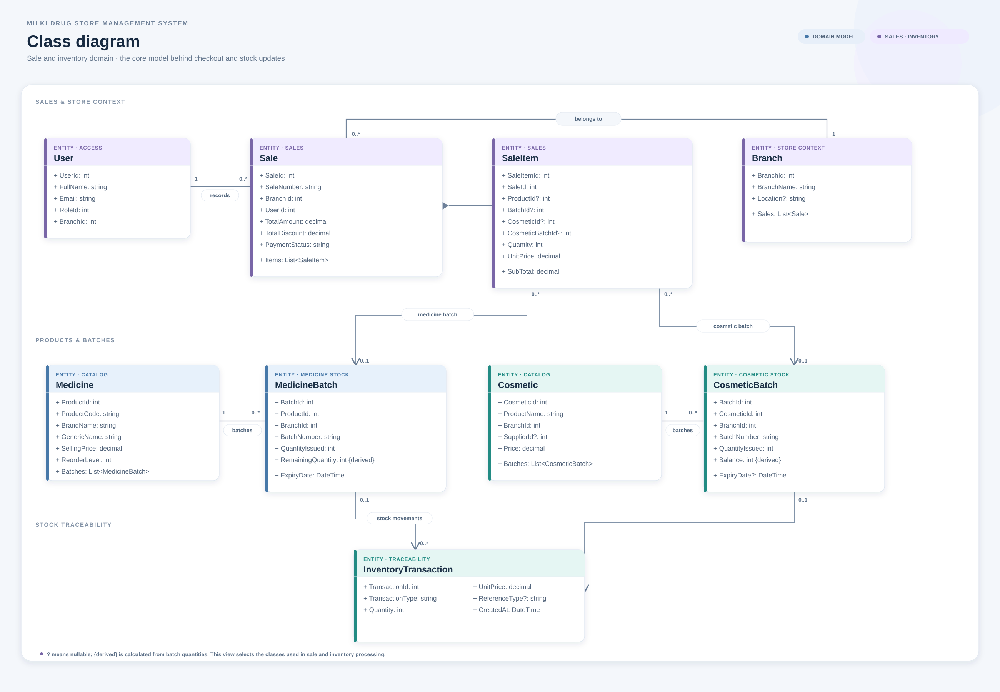

# 3.8 Class Diagram

This class diagram presents the core domain model used by the sale and inventory workflows. It shows the relationship between users, branches, sales, sale items, medicine and cosmetic batches, and inventory transactions. The model supports branch-scoped stock, batch-level sales, and stock movement history.

The diagram includes selected classes to keep the relationships legible. It reflects the implemented entity properties and navigations; the full database model is shown in the [ER diagram](er-diagram.png) and [database schema](database-schema.png).

Files: [PNG image](class-diagram.png), [scalable SVG](class-diagram.svg), and [editable PlantUML source](class-diagram.puml).
